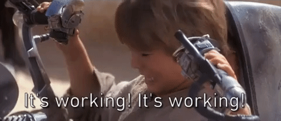
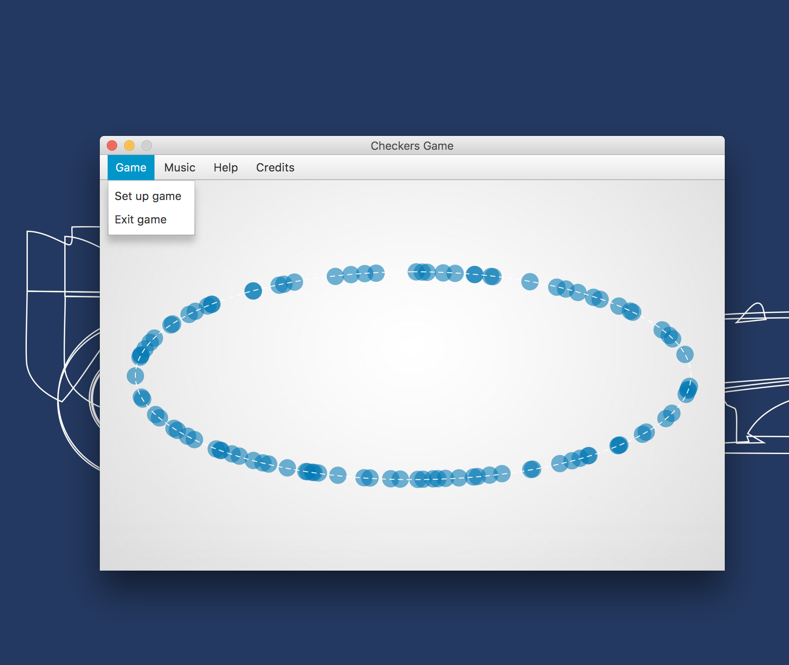
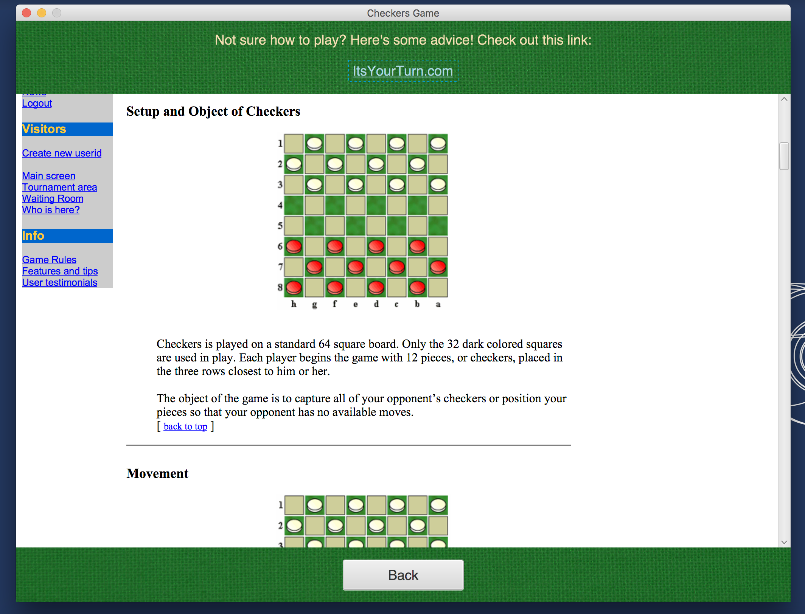
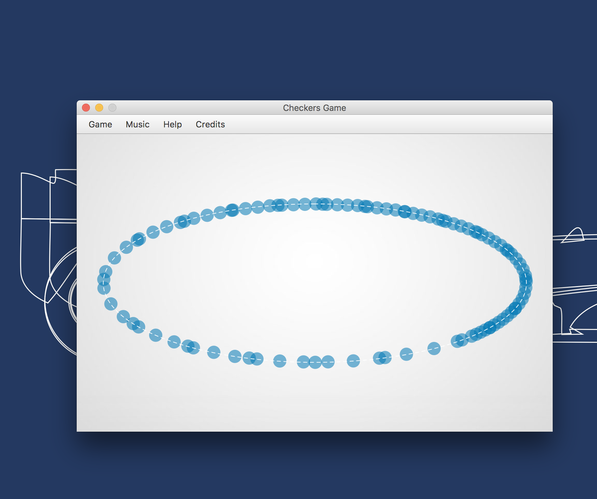
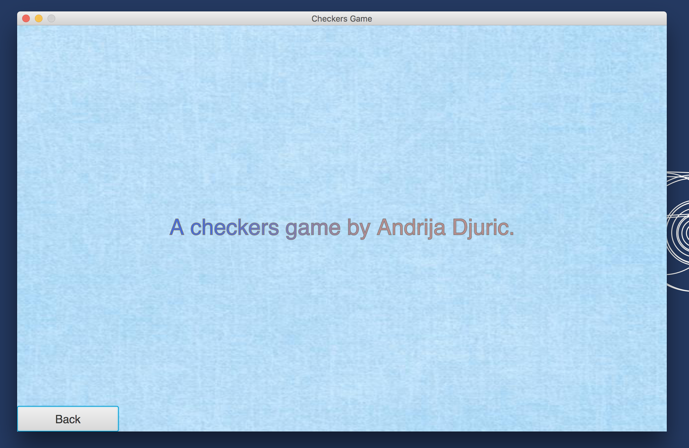
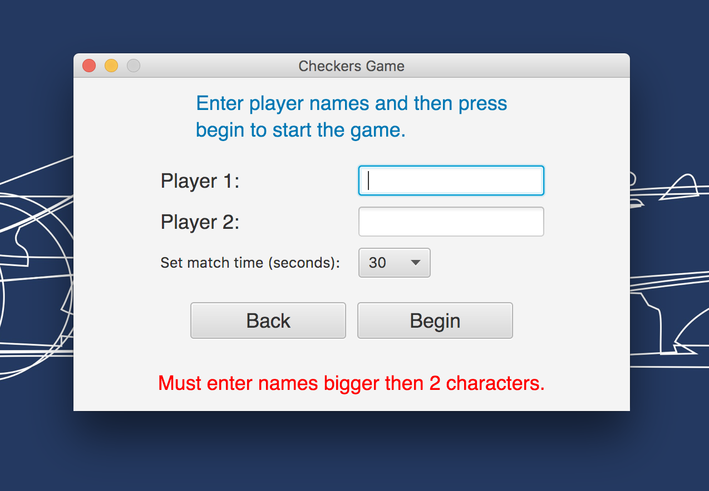
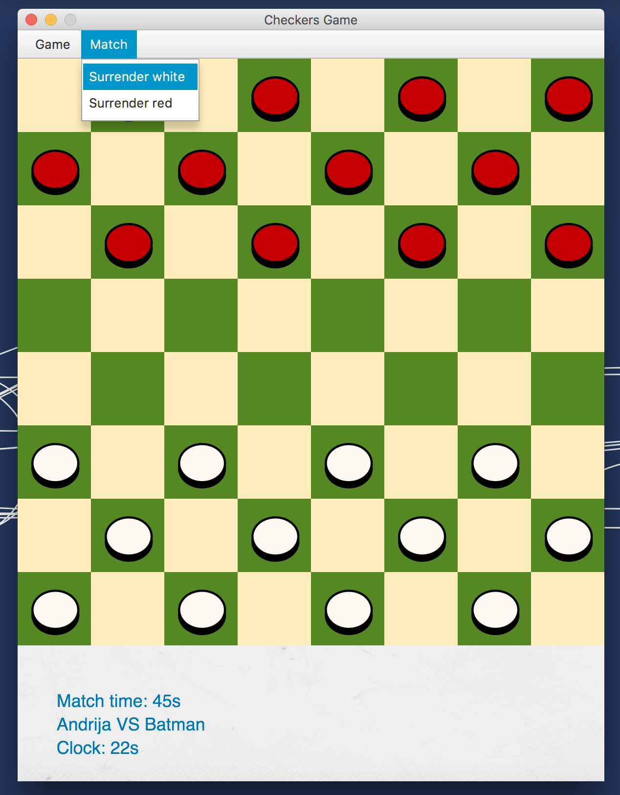
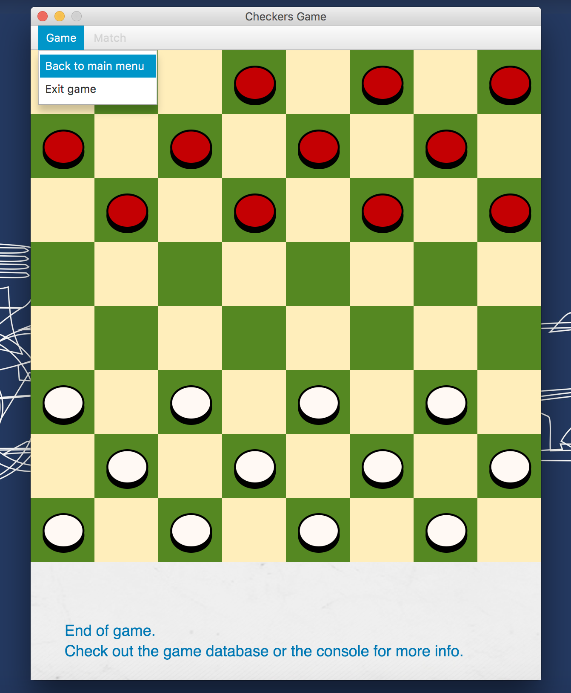

# CS102 Checkers Game Master
<h3>A simple freshman Java project with the following characteristics.</h3>
<ul>
  <li>Made during the <b>CS102 Objects & Data Abstraction</b> course.</li>
  <li>JavaFX graphics and animations.</li>
  <li>A simple MySQL database.</li>
  <li>Somewhat clunky beginner code.</li>
  <li>A music component that plays "Vide Cor Meum" by Patrick Cassidy.</li>
</ul>
<p>Reactions after starting it for the first time:</p>
<kbd></kbd>
<h3>Project boot + A short personal note.</h3>
<p>Made in NetBeans IDE, modified in IntelliJ IDEA. 
Run the Main.java class in the source dir or build a JAR file in your IDE and run it instead.
</p>
<p> It was interesting checking out a project that I made back when I had just started learning engineering.</p>

<p>
Break glass in case of forgetfulness:

```
git add -A
git commit -m "Hello GitHub."
git push origin master
```
... and much more. 💩
</p>

<p>

Learn more Git. This guy is the inspiration @sindresorhus 👾 and check [this](https://help.github.com/articles/basic-writing-and-formatting-syntax/) link for styling descriptions.
</p>

<p>
In the words of fookin' Shakespeare:

> Small commitments become big commitments.

... or whatever. 💩
</p>

<p>

And [this](https://github.com/TheAlgorithms) is a good repo for checking out implementations of various algorithms. 

</p>

#### Project snapshots:
<h6>Starter View &#x2198;</h6>
<kbd></kbd>
<h6>Main Menu View &#x2198;</h6>
<kbd></kbd>
<h6>Rules View &#x2198;</h6>
<kbd></kbd>
<h6>Another Main Menu View &#x2198;</h6>
<kbd></kbd>
<h6>Author View &#x2198;</h6>
<kbd></kbd>
<h6>Setup Game View &#x2198;</h6>
<kbd></kbd>
<h6>Game View &#x2198;</h6>
<kbd></kbd>
<h6>End Game View &#x2198;</h6>
<kbd></kbd>

img[src~="thumbnail"] {
   width:150px;
   height:100px;
}
img[src~="bordered"] {
   border: 1px solid black;
}
