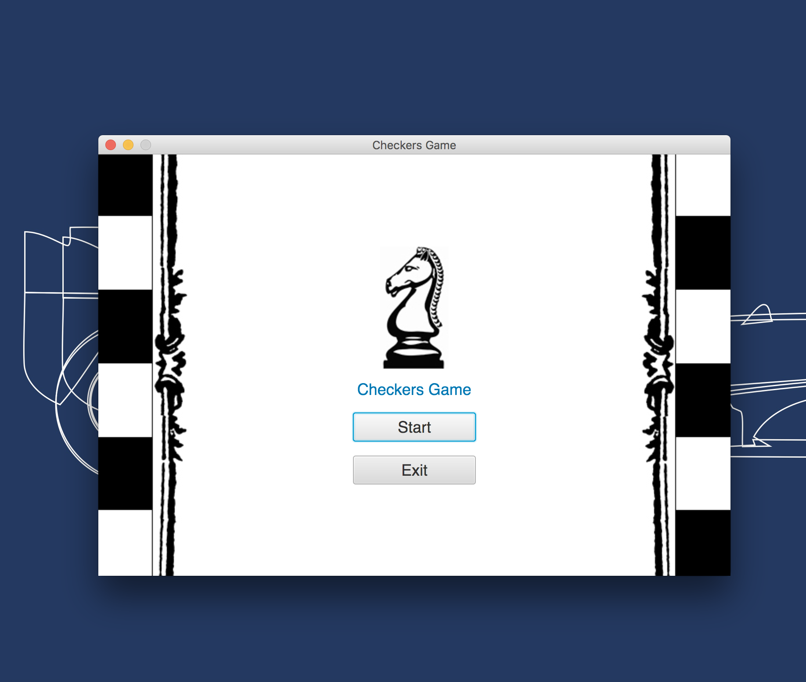
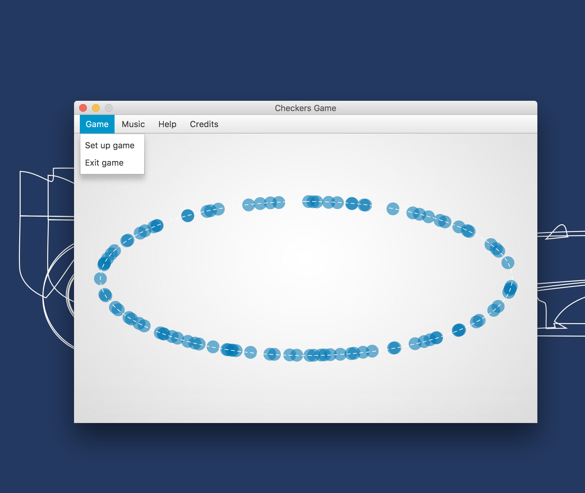
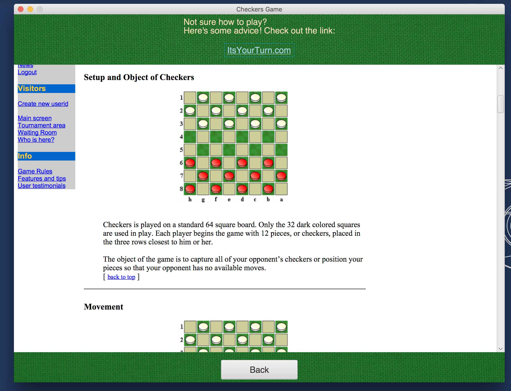
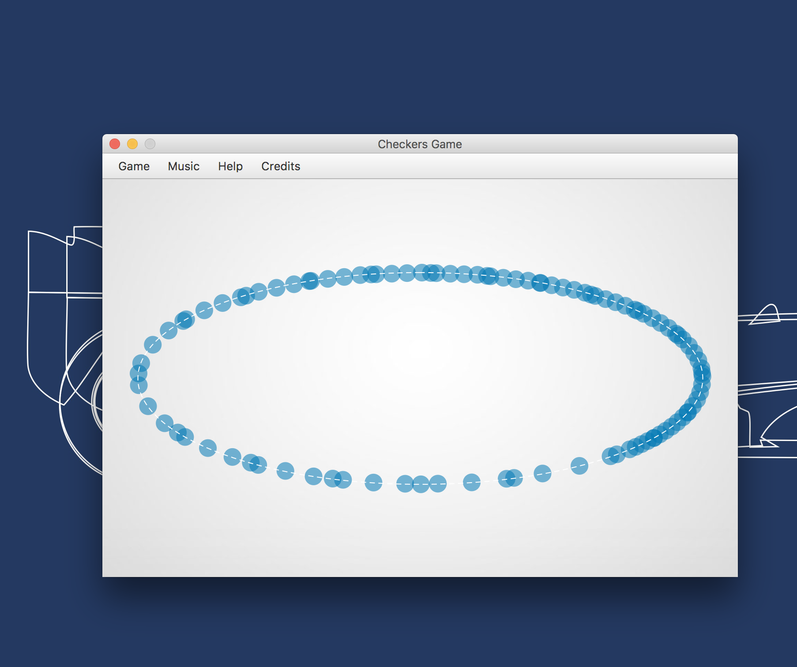
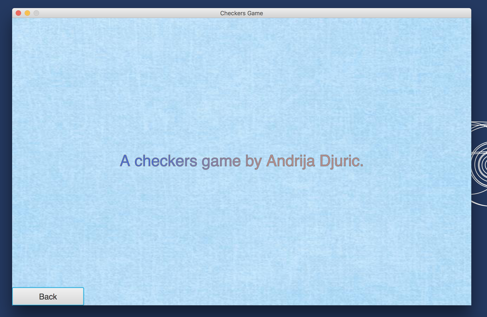
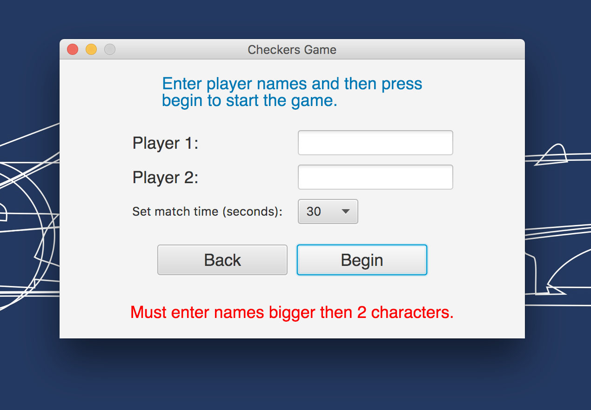
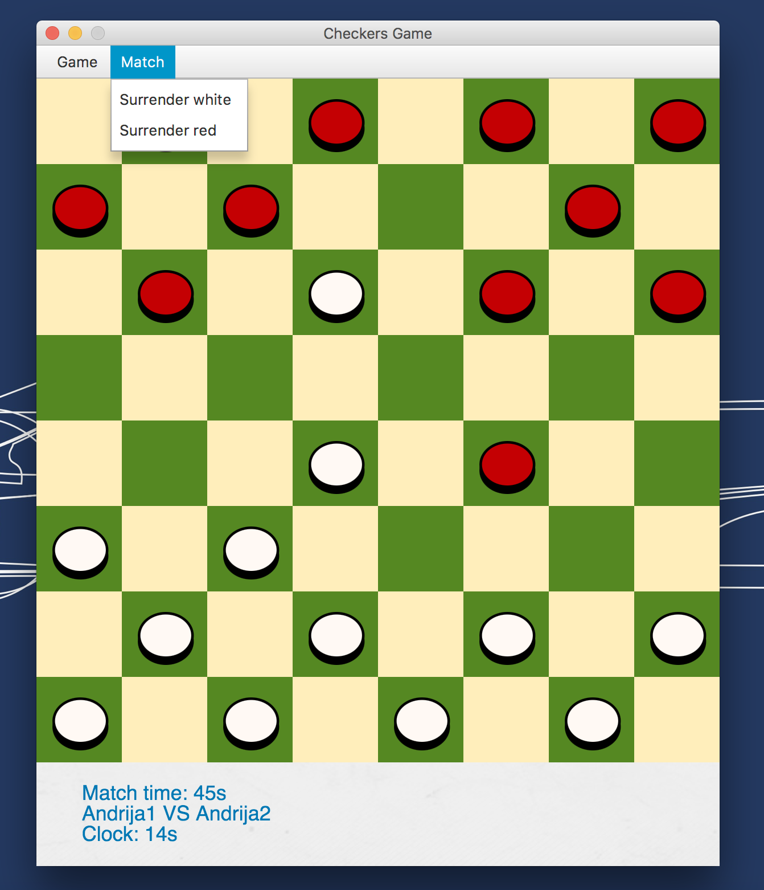
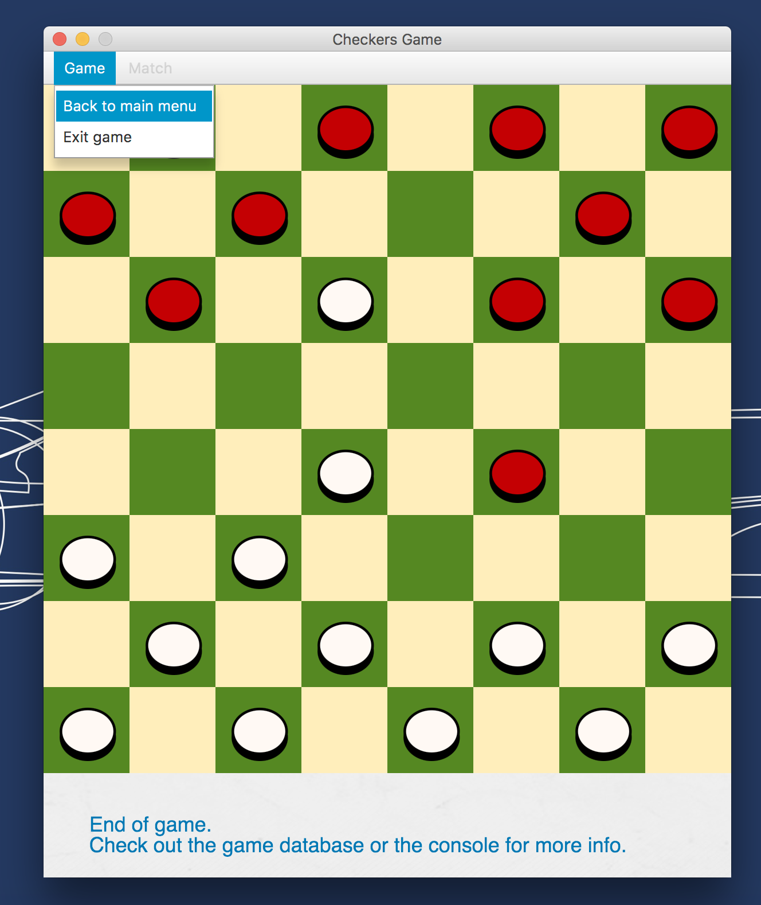

# cs102-checkers-game-master
<h3>A simple freshman Java project with the following characteristics:</h3>
<ul style="list-style-type:circle">
  <li>Made during the CS102 Objects & Data Abstraction course</li>
  <li>JavaFX graphics and animations</li>
  <li>A MySQL database</li>
  <li>Somewhat clunky beginner code</li>
  <li>A music component that plays "Vide Cor Meum" by Patrick Cassidy</li>
</ul>

Note:

Made in NetBeans IDE, modified in IntelliJ IDEA. 
Run the Main.java class or build a JAR in your IDE and then run it.
Was interesting checking out a project that I made back when I had just started learning engineering.
Woo!

<h3>Project snapshots:</h3>

